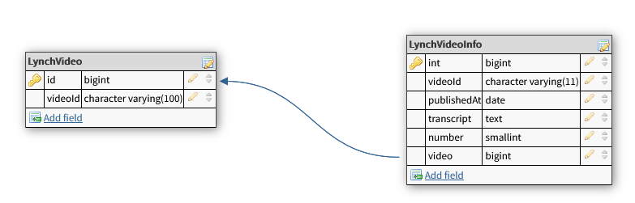

# Today's Number API
Here we go for today's number. Ten balls; each ball has a number; numbers one through ten. Swirl the numbers. Pick a number. Today's number is...

## Base URL
`/`

## API Root
`/api/`

## Statistics
`/api/statistics/`

## Schema


## Lynch Video
`/api/lynchvideos/`

### Response
```json
{
    "count": 853,
    "next": "http://127.0.0.1:8000/api/lynchvideos/?page=2&page_size=2",
    "previous": null,
    "results": [
        {
            "url": "",
            "video": ""
        },
        {
            "url": "",
            "video": ""
        }
    ]
}
```

## Lynch Video Info
`/api/lynchvideoinfo/`

### Filtering
Filter list by `today`, `yesterday`, `week`, `month`, or `year`
```
/api/numbers/?publishedRange={today,yesterday,week,month,year}
```

Get list of dates before/after specified date
```
/api/lynchvideoinfo?publishedAt=2020-08-16
/api/lynchvideoinfo?publishedAfter=2020-08-16
/api/lynchvideoinfo?publishedBefore=2020-08-16
/api/lynchvideoinfo?publishedAfter=2021-01-01&publishedBefore=2021-02-01
/api/lynchvideoinfo?publishedRange=today
/api/lynchvideoinfo?publishedRange=yesterday
/api/lynchvideoinfo?publishedRange=week
/api/lynchvideoinfo?publishedRange=month
/api/lynchvideoinfo?publishedRange=year
```
### Response
```json
{
    "count": 853,
    "next": "http://127.0.0.1:8000/api/lynchvideoinfo/?page=2",
    "previous": null,
    "results": [
        {
            "url": "",
            "videoURL": "",
            "videoId": "",
            "publishedAt": "2020-08-16",
            "transcript": "",
            "number": 8,
            "video": {
                "url": "",
                "video": ""
            }
        },
        {
            "url": "",
            "videoURL": "",
            "videoId": "",
            "publishedAt": "2020-08-17",
            "transcript": "",
            "number": 8,
            "video": {
                "url": "",
                "video": ""
            }
        },
    ]
}
```